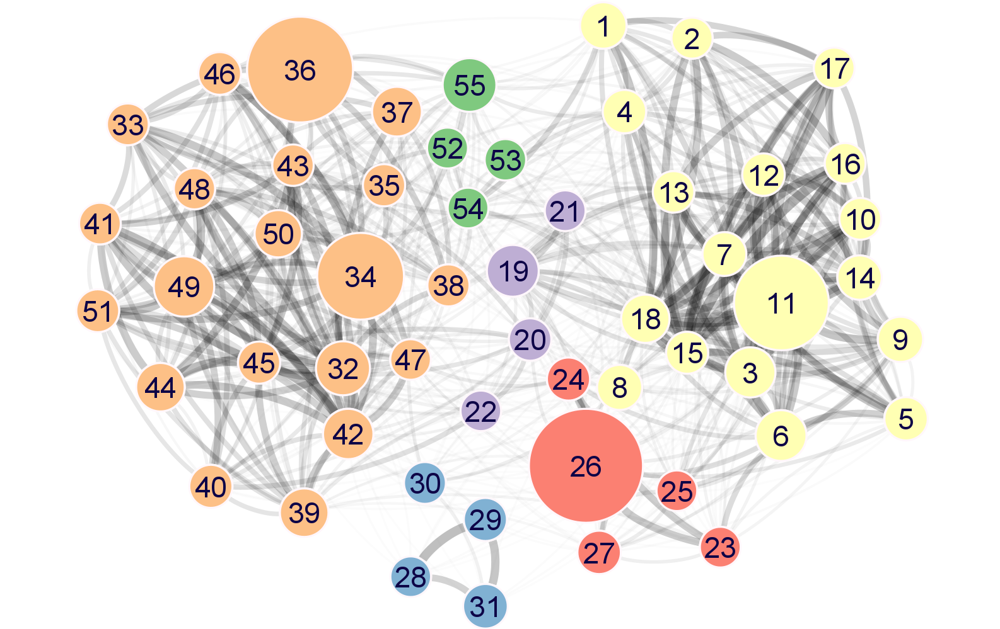

This repository supports data associated with our studies of a co-expression network for mouse pancreatic beta-cells. 

Please cite:
> Anna B Osipovich, et al, manuscript in preparation
> 
> URL to manuscript
> 
> Abstract will go here. Abstract will go here. Abstract will go here. Abstract will go here. Abstract will go here. Abstract will go here. Abstract will go here. Abstract will go here. Abstract will go here. Abstract will go here. Abstract will go here. Abstract will go here. Abstract will go here. Abstract will go here. Abstract will go here. Abstract will go here. Abstract will go here. Abstract will go here. Abstract will go here. Abstract will go here. Abstract will go here. Abstract will go here. Abstract will go here. Abstract will go here. Abstract will go here. Abstract will go here. Abstract will go here. Abstract will go here. Abstract will go here. Abstract will go here. Abstract will go here. Abstract will go here. Abstract will go here. Abstract will go here. Abstract will go here. 

## Explore

Please [explore the data here](https://markmagnuson.github.io/IsletDynamics-GCN/).

## Sample summary

Expression profiles were determined at the following timepoints and genotypes:

TABLE or IMAGE here

## Meta-module network
Each node (numbered) in the meta-network represents a module of highly co-expressed genes.  The meta-network is defined by correlations between module eigengenes, which partitions modules into several distinct and strongly connected groups of modules.

| Meta-module | Color | Image | # of nodes | # of edges                            | All Genes | TF   |
| ----------- | ----- | ---------- | ------------------------------------- | --------- | ---- | ---- |
| A           | #5778A4    |       | 2110 | 1831174 | metamodule-A.filterLevel-any.cyjs.zst |           |
| B           | #E49444    |       | 319 | 67374 | metamodule-B.filterLevel-any.cyjs.zst |           |
| C           | #85B6B2    |       | 1159 | 1173480 | metamodule-C.filterLevel-any.cyjs.zst |           |
| D           | #E7CA60    |       | 257 | 34882 | metamodule-D.filterLevel-any.cyjs.zst |           |
| E           | #A87C9F    |       | 3237 | 4041196 | metamodule-E.filterLevel-any.cyjs.zst |           |
| F           | #F1A2A9    |       | 334 | 63296 | metamodule-F.filterLevel-any.cyjs.zst |           |

## Data preparation & methods

1. Create new git repo, downloaded ZIP for original IsletDynamics-gcn as baseline. Did not fork intentionally to avoid history and accidental contributions to upstream repo.
2. Setup LFS for large file storage for Cytoscape files, `git lfs track 'cysjs/**'`
3. To create images, open Cytoscape
   1. Import file `.cys` 
   2. Layout > Prefuse Force Directed Layout
   3. Layout > yFiles Remove Overlaps
   4. Export image

4. Created a `Cytoscape-all-modules-filterLevel-high.cys` which contains extracted networks for all metamodules, both with "All" genes and "TF only" genes. 

5. 

